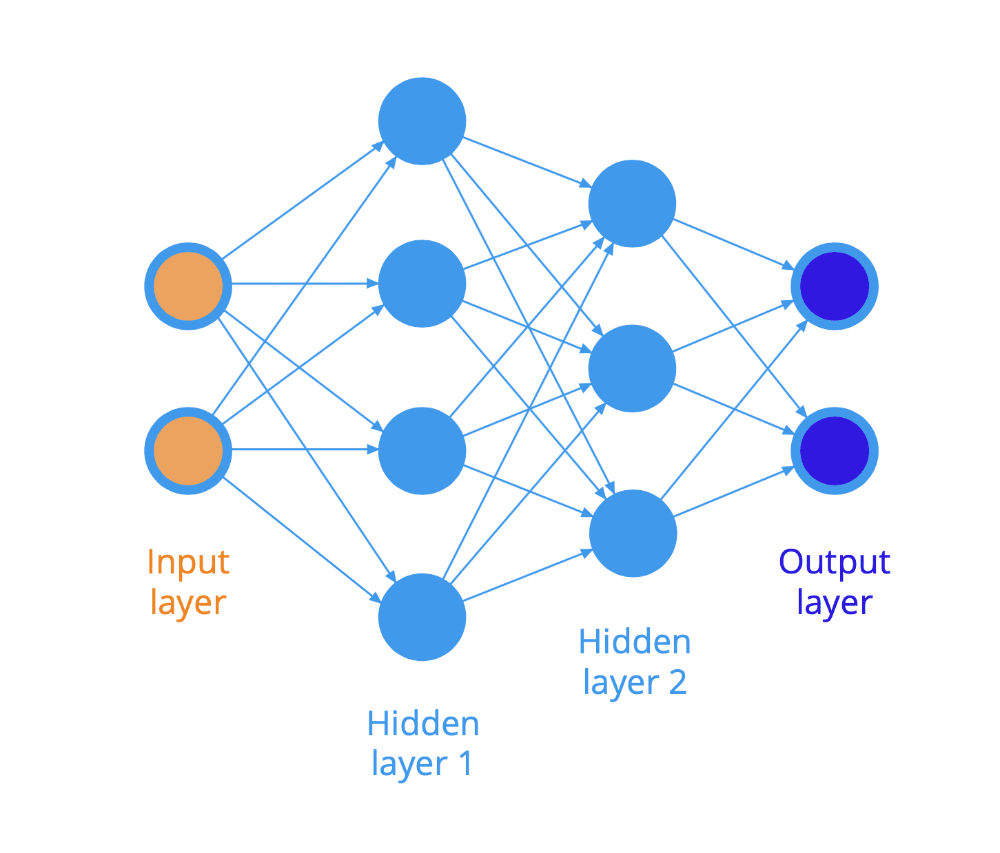
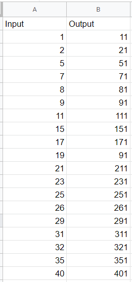
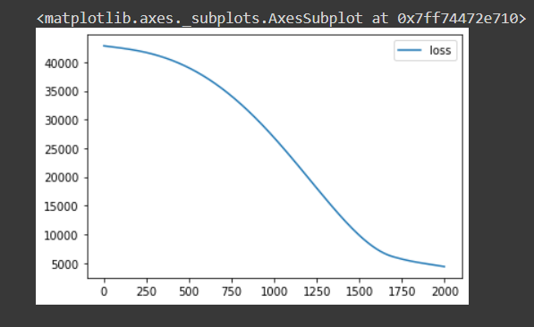
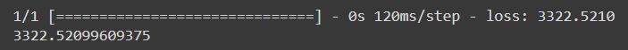
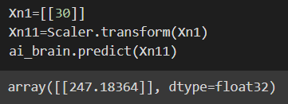

# Developing a Neural Network Regression Model

## AIM

To develop a neural network regression model for the given dataset.

## THEORY

The Neural Network model is a composition of Input layer, Hidden layers and Output layer. The below given model consists of 1 input layer, 2 hidden layers and 1 output layer. The input layer has 2 inputs in which the each inputs are linked to each of the units in the hidden layer 1 and each of the units in the hidden layer 1 is linked to that of the units in the hidden layer 2. And all those units of the 2nd hidden layer is linked to the outputs in the output layer. By the implementation of ReLU function, the below model is worked out.

## Neural Network Model

## DESIGN STEPS

### STEP 1:

Loading the dataset

### STEP 2:

Split the dataset into training and testing

### STEP 3:

Create MinMaxScalar objects ,fit the model and transform the data.

### STEP 4:

Build the Neural Network Model and compile the model.

### STEP 5:

Train the model with the training data.

### STEP 6:

Plot the performance plot

### STEP 7:

Evaluate the model with the testing data.

## PROGRAM
~~~
Program developed by : Shrruthilaya G
Register number : 212221230097

import pandas as pd

from sklearn.model_selection import train_test_split
from sklearn.preprocessing import MinMaxScaler
from tensorflow.keras.models import Sequential
from tensorflow.keras.layers import Dense

df=pd.read_csv("/content/Datasheet - Sheet1.csv")

df.head()

X = df[["Input"]].values
X

Y = df[["Output"]].values
Y

X_train, X_test, Y_train, Y_test = train_test_split(X,Y, test_size=0.33, random_state=33)

Scaler = MinMaxScaler()

Scaler.fit(X_train)
Scaler.fit(X_test)

X_train1 = Scaler.transform(X_train)
X_test1 = Scaler.transform(X_test)
X_train1

ai_brain = Sequential([
    Dense(8, activation = 'relu'),
    Dense(10, activation = 'relu'),
    Dense(1)])

ai_brain.compile(
    optimizer = 'rmsprop',
    loss = 'mse'
)

ai_brain.fit(X_train1, Y_train, epochs=2000)

lossai_brain=pd.DataFrame(ai_brain.history.history)
lossai_brain.plot()

ai_brain.evaluate(X_test1,Y_test)

Xn1=[[30]]
Xn11=Scaler.transform(Xn1)
ai_brain.predict(Xn11)

~~~
### Dataset Information

## OUTPUT

### Training Loss Vs Iteration Plot

### Test Data Root Mean Squared Error

### New Sample Data Prediction

## RESULT
Thus, the neural network model regression model for the given dataset is developed.